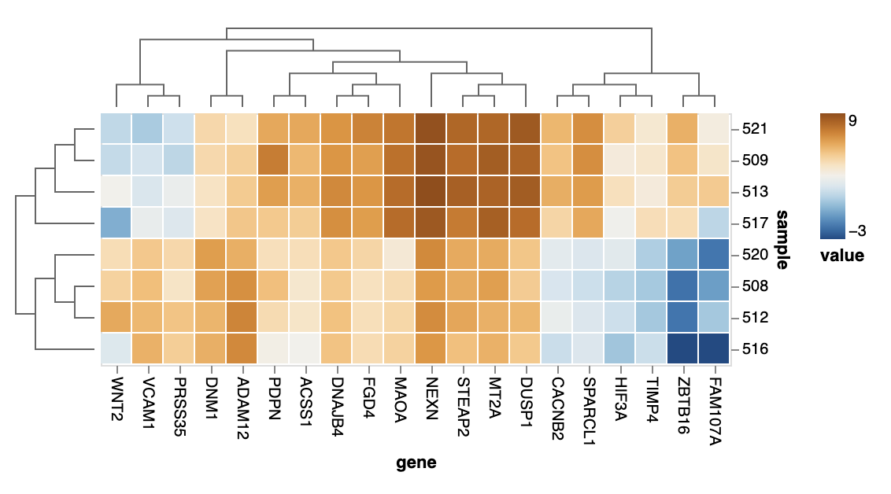

# way

The way that can be named is not the eternal way. – Lao Tzu

A base for building data-oriented websites it Clojure, ClojureScript, and Vega.

## Features

- Web infrastructure
- Web utilities (spinners, modals, forms, etc)
- Vega tooling for clustered heatmaps
- Vega tooling for violin diagrams
- Ag-grid wrapping for data tables

## Clustered Heatmaps

Clustered heatmaps are a powerful data visualization technique that combines the functionalities of heatmaps and hierarchical clustering. A heatmap uses color to represent the values in a data matrix, allowing for an immediate visual assessment of patterns and trends. Each cell in the matrix is colored according to its value, making it easy to spot anomalies and relationships within the data. 

Hierarchical clustering groups similar data points into clusters based on their characteristics, creating a tree (dendrogram).

When these two techniques are combined, the rows and columns of the heatmap are reordered based on the clustering results, grouping similar data points together. This reordering makes the patterns and relationships within the data more apparent. Clustered heatmaps are particularly useful for identifying patterns, reducing data complexity, and revealing hidden structures within large data sets. 

The code to generate clustered heatmaps is actually pretty simple, and lives in two files:

- [Vega specification generator](src/cljs/hyperphor/way/cheatmap.cljs)
- [Clustering](src/cljc/hyperphor/way/cluster.cljc)

A [a simple example](src/cljs/hyperphor/way/demo/heatmap.cljs#L167) of use.

## License

Copyright © 2020-24 Hyperphor

This program and the accompanying materials are made available under the
terms of the Eclipse Public License 2.0 which is available at
http://www.eclipse.org/legal/epl-2.0.

This Source Code may also be made available under the following Secondary
Licenses when the conditions for such availability set forth in the Eclipse
Public License, v. 2.0 are satisfied: GNU General Public License as published by
the Free Software Foundation, either version 2 of the License, or (at your
option) any later version, with the GNU Classpath Exception which is available
at https://www.gnu.org/software/classpath/license.html.
